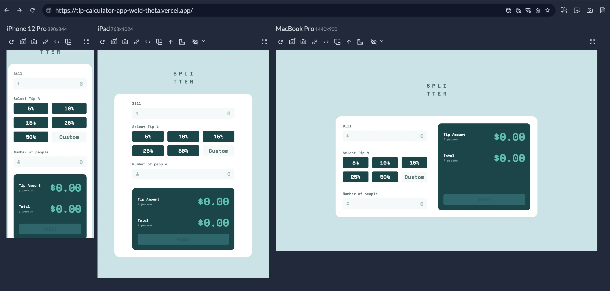
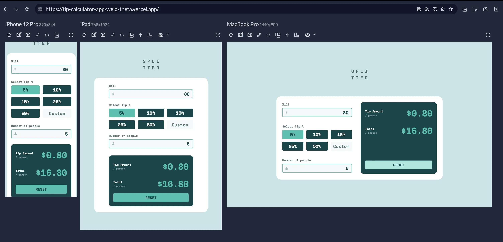
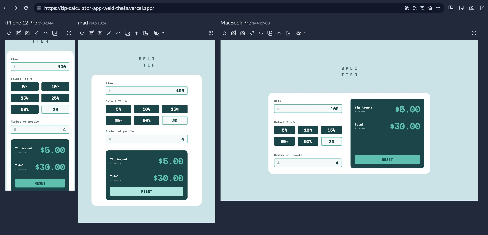
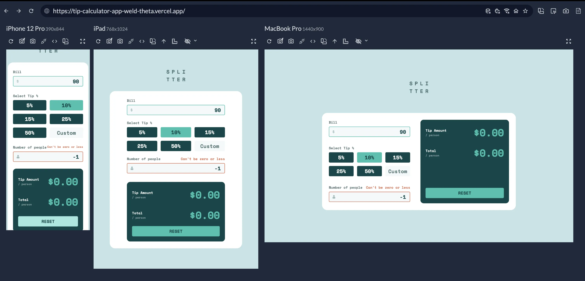

# Frontend Mentor - Tip calculator app solution

This is a solution to the [Tip calculator app challenge on Frontend Mentor](https://www.frontendmentor.io/challenges/tip-calculator-app-ugJNGbJUX). Frontend Mentor challenges help you improve your coding skills by building realistic projects.

## Table of contents

- [Overview](#overview)
  - [The challenge](#the-challenge)
  - [Screenshots](#screenshots)
  - [Links](#links)
- [My process](#my-process)
  - [Built with](#built-with)
  - [What I learned](#what-i-learned)
- [Author](#author)

## Overview

### The challenge

Users should be able to:

- View the optimal layout for the app depending on their device's screen size
- See hover states for all interactive elements on the page
- Calculate the correct tip and total cost of the bill per person

### Screenshots

### Links

- Solution URL: [Find challenge solution here](https://github.com/Oliko136/tip-calculator-app)
- Live Site URL: [Find live page here](https://tip-calculator-app-weld-theta.vercel.app/)

## My process

### Built with

- Semantic HTML5 markup
- Flexbox
- CSS Grid
- Mobile-first workflow
- SASS Preprocessor (SCSS)
- JavaScript
- Vite

### What I learned

I used this challenge to practice writing styles with SASS preprocessor and bundling a project with Vite.

## Author

- LinkedIn - [@olha-sliusarenko](https://www.linkedin.com/in/olha-sliusarenko/)
- X - [@committedto_git](https://x.com/committedto_git)
- Instagram - [@committedto_git](https://www.instagram.com/committedto_git/)
- Frontend Mentor - [@Oliko136](https://www.frontendmentor.io/profile/Oliko136)
